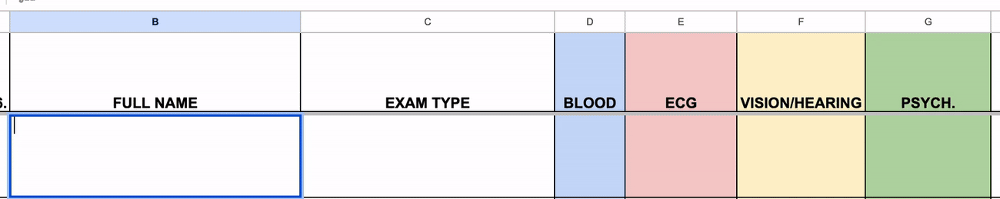
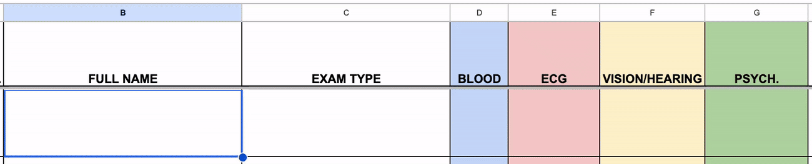
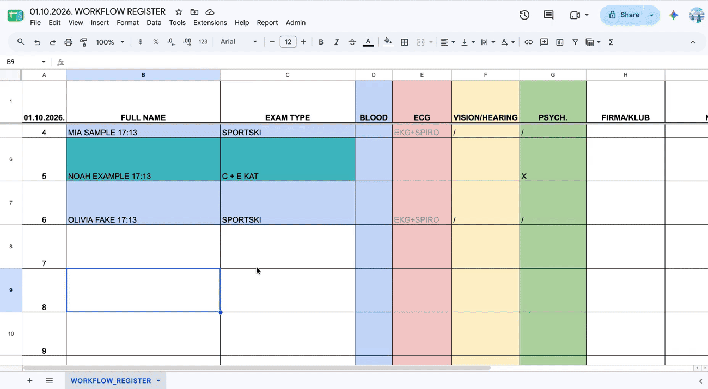
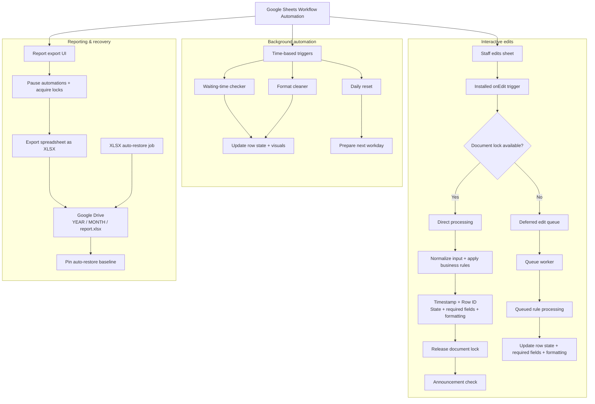

# Spreadsheet Workflow Automation


A Google Apps Script automation layer for a real-world Google Sheets intake/worklist workflow. The project was built as a volunteer automation project for a private outpatient clinic and has been cleaned for public portfolio use.

It turns an existing spreadsheet into an event-driven workflow with normalization, persistent row state, wait-time escalation, concurrency control, configurable admin rules, announcements, daily maintenance and XLSX reporting.

No real patient data, private clinic data, configuration lists, Drive folder IDs, PINs or deployment-specific identifiers are included in this repository.

## Engineering highlights

- installed `onEdit` processing with document/script locking and deferred edit queuing
- fuzzy normalization and domain-specific rule handling
- persistent row IDs, state and signatures to avoid unnecessary repeated writes
- background waiting-time checks, visual escalation and completed-row cleanup
- guarded report export that temporarily pauses competing automation
- XLSX generation, structured Drive storage and revision-based auto-restore baselines
- PIN-protected Admin UI with configurable lists, rules and announcements
- watchdog/retry behavior for daily reset and background jobs

## Demo

### Edit processing and normalization



*An anonymized demo using fake data: a new entry is automatically timestamped and standardized, the deliberately misspelled exam type `spotki` is fuzzy-matched and normalized to `SPORTSKI`, required examination fields are populated automatically, and workflow-specific formatting is applied.*

### Background wait-state automation



*The background wait checker detects when an eligible sports-workflow row exceeds the configured 45-minute threshold and automatically escalates the row with a visible waiting warning while preserving its operational fields and workflow state.*

### Report aggregation and XLSX export



*The reporting workflow automatically counts category/driver-exam and sports-exam entries from the exam-type field, writes those totals into the end-of-day summary, generates an XLSX report, and saves it into a structured Google Drive year/month folder. This replaces a manual Ctrl+F counting step and avoids false positives from unrelated text such as names containing `kat`.*

All demos use fake data only. No real patient, clinic, company, staff, folder or contact data is shown.

## Architecture

The system has three coordinated paths: interactive edit processing, background automation, and reporting/recovery.



The implementation is split across 27 Apps Script modules plus HtmlService UI templates. The full module-by-module reference is in [docs/TECHNICAL_REFERENCE.md](docs/TECHNICAL_REFERENCE.md).

## Project context

The clinic already used Google Sheets as a daily patient intake and worklist tool. My contribution was to map the operational workflow and build an automation layer around that existing process rather than replace it with a new platform.

The project involved roughly 200 hours of iterative design, implementation and testing. AI-assisted programming was used as a coding aid, while workflow design, requirements, testing, domain decisions and final integration were guided manually.

This is an operational workflow automation project, not a medical device, diagnostic tool or clinical decision-support system.

## Workflow at a glance

1. Staff enter a patient/case into the working sheet.
2. The script timestamps and standardizes the row.
3. Exam/category input is normalized and required helper fields are populated.
4. Row state and visual status are maintained as the workflow changes.
5. Background jobs handle waiting-time escalation, cleanup and daily reset.
6. Admin-configured rules and announcements can affect matching rows.
7. End-of-day reporting aggregates the sheet and exports an XLSX file to Drive.

## Repository layout

```text
README.md
LICENSE
CLASP_NOTES.md
assets/
  demo-workflow.gif
  demo-wait-state.gif
  demo-report-export.gif
docs/
  DEMO_ASSETS.md
  SETUP.md
  TECHNICAL_REFERENCE.md
  TROUBLESHOOTING.md
  full-source-final-monolithic.md
src/
  00_Project_Overview.gs
  01_Config.gs
  ...
  27_Report_Export_Backend.gs
  AdminConfig.html
  AdminPin.html
  AnnouncementModal.html
  ReportDownloadDialog.html
  ReportSaveDialog.html
  appsscript.json
```

## Documentation

- [Technical reference](docs/TECHNICAL_REFERENCE.md) — detailed workflow, sheet structure, row-state concepts, full 27-module architecture and glossary.
- [Setup and deployment](docs/SETUP.md) — requirements, configuration, Drive setup, Admin PIN, trigger installation and deployment notes.
- [Troubleshooting](docs/TROUBLESHOOTING.md) — common deployment and runtime problems.
- [Demo assets](docs/DEMO_ASSETS.md) — the anonymized portfolio demos included in this repository.
- [CLASP notes](CLASP_NOTES.md) — notes for a future `clasp`-based workflow.

## Public-repository safety

This repository is a cleaned public version of a real spreadsheet automation system. Private deployment values and operational data are intentionally excluded. The demo GIFs use fake names and fake workflow data.

The code is tightly coupled to a specific spreadsheet layout and is not intended as a plug-and-play clinic product. A future production-grade version would be better implemented as a dedicated application with a database, authentication, audit logs, role-based permissions and a purpose-built UI.

## License

MIT — see [LICENSE](LICENSE).
