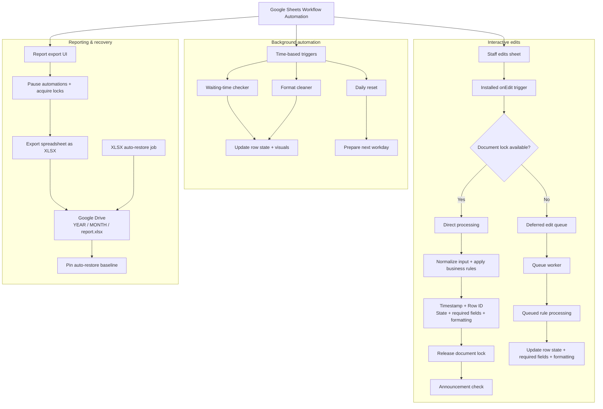

# Technical Reference

This document contains the detailed workflow and architecture reference moved out of the main README so the repository landing page stays portfolio-friendly.

## What this project does

This script acts as a runtime automation layer for a Google Spreadsheet.

Main features:

- processes edits made in the spreadsheet through an installed `onEdit` trigger
- standardizes text input in operational columns
- normalizes visit/type values in column C, including fuzzy matching and domain-specific corrections
- handles special categories such as short waiting, category-like entries, sports entries, training-related entries, billing states, priority markers and announcement prompts
- adds timestamps to new rows and stores them safely by row ID
- tracks row state through internal system columns
- highlights rows visually based on priority, waiting time, type of visit, billing state and other business rules
- uses a queue system to defer edit processing when the sheet is busy
- uses locks to reduce conflicts between edits, background jobs, report export and daily reset
- performs daily reset of the operational sheet
- exports the full spreadsheet as an XLSX file into a configured Drive folder
- creates an auto-restore baseline for exported XLSX reference files
- provides an Admin UI protected by a PIN
- stores configurable lists such as doctors, companies, clients, clubs, institutions, priority terms and announcements
- provides announcement popups for matching patients, companies or keywords
- does not send email

## Operational workflow

This project was built for a daily intake/worklist spreadsheet.

During the working day, staff enter patients into the sheet row by row. Each row represents one active patient/case currently being handled. The script watches edits, standardizes the input, adds missing operational data, highlights important rows, tracks waiting time and prepares the sheet for reporting at the end of the day.

The workflow is roughly:

```text
1. A new patient/case is entered into the working sheet.
2. The script adds or preserves the time of arrival.
3. Staff enter the type/category of visit.
4. The script normalizes the type/category and fills helper fields where needed.
5. Staff add company/client/club/billing information when relevant.
6. The script detects configured clients, contract clubs, training companies and special institutions.
7. The script visually marks rows that need attention.
8. Background triggers check waiting time and update row status.
9. Completed rows are crossed out.
10. The format cleaner cleans completed rows while preserving active waiting/priority states.
11. At the end of the day, the report is exported as XLSX.
12. The daily reset prepares the spreadsheet for the next workday.
```

## Expected sheet structure

The original Google Sheet used a frozen header row with the following columns.

| Column | Header | Purpose in workflow |
|---|---|---|
| A | datum | Date / sequence column. Cell `A1` stores the workday date used for report naming. Rows below the header can be used for row numbering after reset. |
| B | ime i prezime | Patient name and arrival time. The script adds/preserves the timestamp here. Strikethrough in this column marks the row as completed. |
| C | pregled | Visit/exam type. This is the main normalization column. The script standardizes entries such as work exams, sports exams, category exams and other configured types. |
| D | krv | Blood/lab marker. The script can fill this automatically depending on the exam type. |
| E | EKG | ECG marker. The script can fill this automatically, including sports placeholders. |
| F | VID | Vision/ophthalmology marker. The script can add required vision-related markers based on configured rules. |
| G | psiholog | Psychologist marker. The script can fill this automatically for relevant categories. |
| H | firma/klub | Company, client, club or billing field. The script detects configured companies, invoice clients, contract clubs, training companies and billing states. |
| I | napomene | Notes, priority markers, announcement output and location tags. The script also uses this column for visual priority detection. |
| J | doktor | Doctor initials / shortcut input. Short codes can update initials or add location-like tags into column I. |
| K | sistematski doktor | Additional doctor/systematic exam doctor field. |
| L | kontakt | Contact field. If the value contains `@`, the script highlights the cell. |
| M | system ID | Internal row UUID used by the script. Should be hidden/protected. |
| N | system state | Internal row state used by the script. Should be hidden/protected. |
| O | system signature | Internal row signature used by the script. Should be hidden/protected. |

The exact column constants are configured in module 1.

Do not delete or reorder columns without updating the constants. The automation relies on these indexes for edit handling, row state tracking, formatting, report export, waiting-time checks and daily reset.

## Main spreadsheet concepts

### Active row

An active row is a row representing a patient/case that is currently still in the workflow.

Active rows are processed by edit triggers, waiting-time checks, formatting rules and announcement checks.

### Completed row

A completed row is marked by applying strikethrough formatting in column B.

The format cleaner detects completed rows and cleans their visual formatting and internal state.

### Waiting state

The script tracks waiting time from the timestamp stored in column B.

Rows can become visually escalated when they pass configured waiting thresholds. Special shorter waiting logic can apply to configured categories such as sports-related rows.

### Priority state

Priority rows are detected from configured terms in the note/priority column.

When a row is priority, the script applies stronger visual formatting and preserves that state during cleanup and waiting-time processing.

### Internal row identity

Each active row receives a UUID stored in a hidden/system column.

This allows the script to remember the original timestamp and waiting flags even if the visible row text changes.

### Row state and signature

The script stores a lightweight row state and row signature in internal columns.

This prevents unnecessary repeated writes and helps the script know whether a row is active, waiting, priority, completed or system/report-related.

## Architecture

The system has three coordinated paths: interactive edit processing, background automation, and reporting/recovery.



The code is organized into 27 Apps Script modules, with HtmlService UI templates separated into `.html` files for cleaner maintenance:

1. `CONFIG` — system constants, column indexes and operational limits.
2. `BINDING` — spreadsheet context and target sheet binding.
3. `HELPERS` — generic helpers, normalization and patch infrastructure.
4. `QUIET HOURS` — quiet-hours execution mode.
5. `SHORT WAIT` — short waiting-time configuration and activation.
6. `LOCK ENGINE` — concurrency control and execution synchronization.
7. `EDIT QUEUE` — deferred edit-event processing queue.
8. `FUZZY STANDARDIZATION C` — fuzzy standardization of values in column C.
9. `KAT / SPORT NORMALIZATION` — domain normalization for category, sports, PUR/REGISTER-style workflow markers and related combinations.
10. `TRAINING` — training-scenario detection.
11. `REPORT INTERRUPT` — temporary automation suspension during report export.
12. `REPORT EXPORT UI` — report export menu, status and user dialogs.
13. `APPLY RULES` — central dispatcher for edit-triggered rule processing.
14. `HANDLER J` — initials and location-tag handling.
15. `HANDLER B` — time handling and persistence in column B.
16. `HANDLER C/H` — business-rule handling for columns C–H.
17. `WAIT CHECKER` — waiting-time evaluation and status escalation.
18. `FORMAT CLEANER` — format and content cleanup for completed rows.
19. `DAILY RESET` — daily reset, watchdog and retry mechanisms.
20. `XLSX AUTORESTORE` — revision-based auto-restore for XLSX reference files.
21. `DRIVE AUTH` — one-time Drive authorization helper.
22. `TRIGGERS` — installed trigger management.
23. `ONEDIT` — main edit-event entry point.
24. `ADMIN CONFIG` — administrative configuration and PIN protection.
25. `OPERATIVE SETTINGS` — configuration layer for clients, clubs and operational rules.
26. `ANNOUNCEMENTS` — patient, company and keyword announcement system.
27. `REPORT EXPORT BACKEND` — XLSX save, auto-restore baseline and failsafe export.

## Glossary

- `GAS` — Google Apps Script.
- `PUR` — legacy workflow marker retained from the original spreadsheet logic. It is not a private value; it is part of the automation grammar.
- `REGISTER` — public/neutral workflow marker used in the cleaned version where applicable.
- `KAT` — category-related workflow marker retained from the original spreadsheet logic.
- `category exam` — category-related exam/workflow marker used in the original spreadsheet.
- `sports exam` — sports-related exam marker.
- `PL` — paid billing marker.
- `NAPLATITI` — pending payment marker retained from the original local workflow.
- `vision marker` — vision/ophthalmology-related marker used by the workflow.
- `Admin UI` — internal configuration dialog built with Apps Script `HtmlService`.

## Limitations

This project is tightly coupled to a specific spreadsheet layout and workflow.

It is not a plug-and-play general clinic system. To reuse it, you must adapt the column constants, sheet names, Drive folder IDs, trigger setup and Admin configuration.

Google Apps Script was a practical choice because the clinic already used Google Sheets, but Apps Script is not ideal for larger long-term systems that need robust database design, access control, audit logs, advanced user roles or complex UI flows.

A dedicated web application would be the natural next step for a production-grade version of this workflow.
